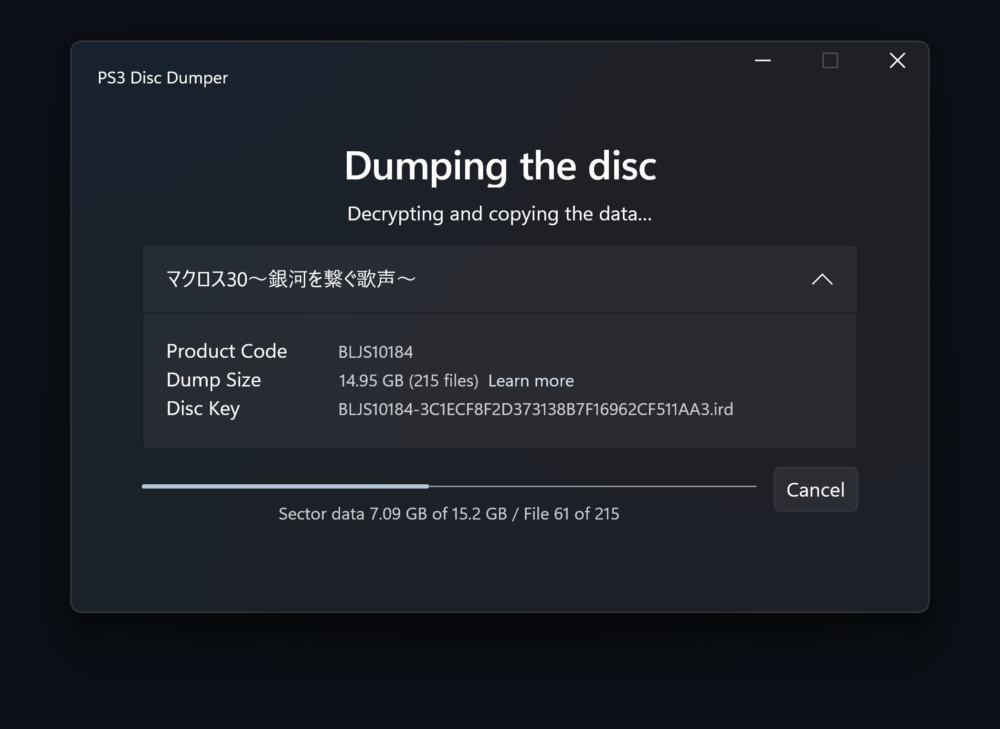

PS3 Disc Dumper
===============
This is a small utility to make decrypted copies of the PS3 game discs, suitable for use in emulators.

It does require a [compatible blu-ray drive](https://rpcs3.net/quickstart) and existence of a matching [disc key](http://www.psdevwiki.com/ps3/Bluray_disc#IRD_file) to work.

Requirements
============
* Compatible blu-ray drive
* Disc must have decryption key, either in redump database or in the IRD Library
* For binary release you might need to install .NET prerequisites
  * See `Supported OS versions` and `Dependencies` sections in [documentation](https://learn.microsoft.com/en-us/dotnet/core/install/windows?tabs=net60#dependencies)

How to use
==========
1. Put `ps3-disc-dumper` executable in any folder
   * On Linux make the file executable (via `Properties > Permissions` or via console command `$ chmod +x ./ps3-disc-dumper`)
2. Start the dumper
3. Follow the instructions
    * On Linux you may need to confirm auto-mount or to mount the disc manually (either through file manager or via console command `$ mount`)

By default all files will be copied in the folder where the dumper is, you can select different location in `Settings`.

If you have custom key or IRD file, you can put it in local cache (see `Settings` for exact location).

Logs can be found in `Settings` at the bottom.

Screenshots
===========
Windows 11

<picture>
  <source media="(prefers-color-scheme: dark)" srcset="./screenshots/windows11-dark.png">
  <source media="(prefers-color-scheme: light)" srcset="./screenshots/windows11-light.png">
  
</picture>

Ubuntu 22.04

<picture>
  <source media="(prefers-color-scheme: dark)" srcset="./screenshots/ubuntu-dark.png">
  <source media="(prefers-color-scheme: light)" srcset="./screenshots/ubuntu-light.png">
  
</picture>

Building
========
* To compile the solution, you will need to have [.NET 7.0 SDK](https://www.microsoft.com/net/download) installed on your machine.
* It is recommended to use [JetBrains Raider](https://www.jetbrains.com/rider/), [Visual Studio](https://visualstudio.microsoft.com/), or [VS Code](https://code.visualstudio.com/) for development.
  * On Linux select the Linux configuration to prevent various issues due to Windows-specific dependencies.
  * You can build for both Windows and Linux on Windows (you can test Linux build with WSL2 or with a Linux VM).
